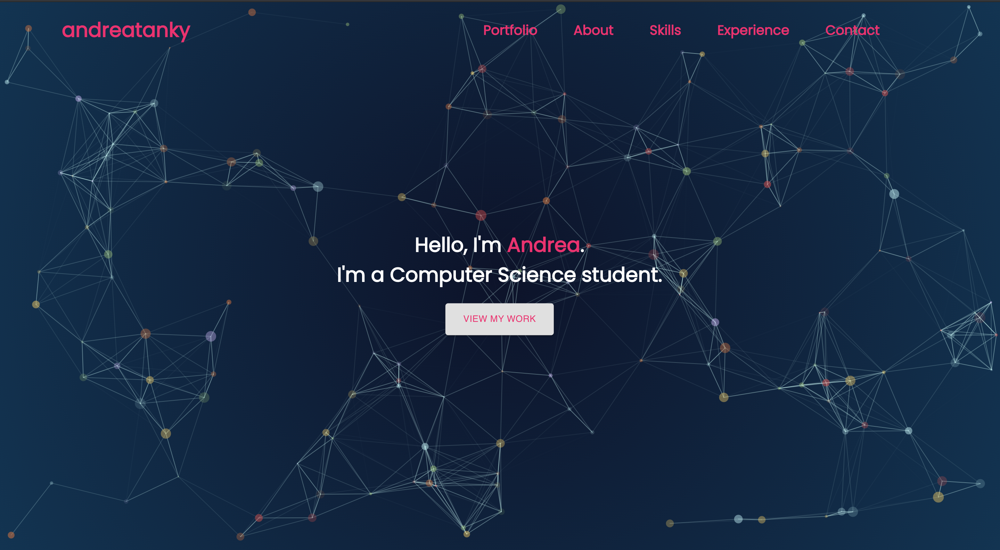

# My Personal Portfolio

This website was created to summarise my tech adventure as a Computer Science undergraduate in NUS. It is created with React.

## Sections
The website includes the following sections:
* Landing page
* About me
* Experience
* Skills
* Portfolio
* Contact

## Tech Stack
* [React](https://reactjs.org/)
* [React Particles](https://www.npmjs.com/package/react-particles-js)
* [Material-UI](https://material-ui.com/)
* [Animate On Scroll](https://michalsnik.github.io/aos/)
* [react-animate-on-scroll](https://www.npmjs.com/package/react-animate-on-scroll)
* [React Router Hash Link](https://www.npmjs.com/package/react-router-hash-link)

Other packages used for both production and development can be found in package.json.

## Deployment
This website is hosted on Netlify.
Click [here](https://andreatanky.netlify.app) to view the site.

